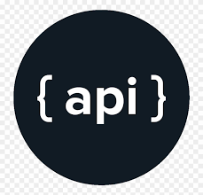

<!--
new
-->

<h1 align="center">
Hi there! Welcome to my repo
 

<!-- 
<h1 align="center">
Hi there,
	I'm Deepak Avudiappan
  -->
<h1 align="center">🛠️ My Favorites</h1>
<table align= "center">
  <tr>
     <td align="center" width="140" height="112.43">
      
       Python
    </td>
    <td align="center"  width="140" height="112.43">
      
       Machine Learning
    </td>
    <td align="center"  width="140" height="112.43">
      
       AWS 
    </td>
    <td align="center"  width="140" height="112.43">
      
       MongoDB
    </td>
    <td align="center"  width="140" height="112.43">
      
       PostgreSQL
    </td>
    <tr>
       <td align="center" width="140" height="112.43">
        
         Git
      </td>
      <td align="center"  width="140" height="112.43">
        
         API Development
      </td>
  <!--       -->
      <td align="center"  width="140" height="112.43">
        
         Web Scraping
      </td>
      <td align="center"  width="140" height="112.43">
        
         Chatbot
      </td>
      <td align="center"  width="140" height="112.43">
        
         JAVA
      </td>
   </tr>
  </tr>
</table>
 

 ✔️  
## 🛠️ My tools
### 👨‍💻 Programming languages

    
    
    
    
    
    
    
    
    
    

### 🧰 Frameworks and libraries

    
    
    
    
    
    
    
    
    

### 🗄️ Databases and cloud hosting

    
    
    
    
    
    
    
    
    
    
    				

### 💻 Software and tools

    
    
    
    
    
    
    	
    	
    
    
    
    
    
    
    
    
    
    
    	

 
<h3>📊 Github stats<h3>

## Let's Connect

<!--https://img.icons8.com/bubbles/50/000000/linkedin.png 		  -->
<!-- 	 -->
<!-- 	 -->
	
	
	

